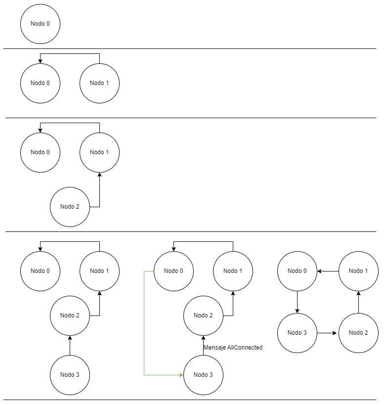

## TP2 - Heladería

Una importante cadena de heladerías desea abrir una sucursal completamente robotizada. Los clientes harán su pedido sobre una interfáz gráfica eligiendo gustos y tamaño. Luego un conjunto de robots podrán resolver los pedidos de forma concurrente, tal como lo hacen los heladeros los días de calor. Así mismo, cada contenedor con un gusto de helado podrá ser utilizado solamente por un robot a la vez. Finalmente se le entregará su helado al cliente; y solamente se le cobrará en la tarjeta si efectivamente se pudo completar su pedido.

### Integrantes

| Alumno          | Padrón |
| --------------- | ------ |
| Lucas Grati     | 102676 |
| Theo Jorge      | 107862 |
| Máximo Palopoli | 108755 |

 

# Ejecución de los programas

Para la ejecución del sistema en conjunto, se va a tener que ejecutar los 3 tipos de aplicaciones al mismo tiempo: El Gateway, los Robots y las Pantallas.

Primero, se levanta el Gateway, ejecutando el comando:

`cargo run --bin gateway 20`

Si no queremos agregar el parámetro de porcentaje de rechazo, se usará uno predeterminado (10%) usando el comando:

`cargo run --bin gateway`

Luego, se van a levantar los robots. Para levantar los robots, se los va a tener que levantar uno por uno, ejecutando con cada uno el comando:

`cargo run --bin robot <robot_id> <total_robots>`

Siendo robot_id el id del robot que se va a levantar y total_robots el total de robots a levantar.

Por ejemplo, si quisieramos una topología de 2 robots, ejecutaríamos los comandos:

`cargo run --bin robot 0 2`

`cargo run --bin robot 1 2`

Por último, levantamos las pantallas, con una metodología similar, pero incluyendo al final el nombre del archivo a leer por las mismas:

`cargo run --bin screen <screen_id> <total_screens> <file_name>`

Por ejemplo, si quisieramos una topología de 2 screens con un archivo de pedidos 'orders.json' (como el que usamos como prueba), ejecutaríamos los comandos:

`cargo run --bin screen 0 2 orders.json`

`cargo run --bin screen 1 2 orders.json`

Una vez que levantamos todo se comienza a ejecutar el sistema.

## Tests

Se proveen distintos casos de prueba de la aplicación. Se pueden ejecutar con:

`cargo test`

# Diseño

## Arquitectura

Diagrama de arquitectura del sistema.

- Se utilizan varios robots que se comunican entre sí formando una topología de anillo.
- Dentro de los robots, habrá un líder (marcado en amarillo), al cual se conectan todas las pantallas.
- Las pantallas tambien se comunican entre si formando una topologia de anillo.
- Dentro de las pantallas, habrá un líder (marcado en amarillo), que sera la pantalla encargada de comunicar los pedidos al robot lider.
- Las pantallas se conectan al gateway de pagos para manejar las transacciones de los clientes.

## Robots

### Armado de la red:

Para lograr armar la red, debemos instanciar cuantos robots queramos que haya en dicha red usando el comando:

`cargo run --bin robot`

Este comando instancia un robot, al cual automáticamente le asigna un id y puerto. El primer robot tendrá el id 0 y estará vinculado al puerto 5000, y los siguientes robots a los puertos 5001, 5002, y así sucesivamente. A medida que se van agregando robots, estos se van insertando en la red respetando la topología de anillo. La ventaja de levantar cada robot en su propia terminal es que, al momento de probar los casos de desconexión de robot, solamente debemos realizar `Ctrl+C` en la terminal donde se está ejecutando para simular su desconexión.

Nota: Inicialmente, el líder será el robot con id 0, es decir, el primero. Solo se cambiará de líder si ese robot se desconecta.

### Inserción de robots en la red:

El siguiente diagrama muestra cómo se instancian 4 robots en la red y cómo se construye la red respetando la topología de anillo.

1. Inicialmente, solamente está el Robot 0 en la red. Al ser el robot con ID 0, sabe que es el inicial y no necesita buscar otras conexiones.

2. Se instancia el Robot 1, quien automáticamente se conecta con el Robot con ID que lo precede, el 0. El Robot 1 también informa al Robot 0 que él es el Robot que precede en la red al Robot 0. El Robot 0 recibe esta información y sabe que el Robot que más recientemente se unió a la red es el Robot 1 y crea la conexión hacia él, formando un anillo de 2 Robots. Como el Robot 0 no tenía conexiones iniciadas, no necesita cerrarlas.

3. Ahora se instancia el Robot 2, automáticamente se va a conectar con el Robot cuyo ID lo precede, el 1. El Robot 2 también informa que es el Robot que precede (en la red) al Robot 1, este mensaje circula por la red hasta llegar al Robot 0. El Robot 0 recibe esta información y sabe que el robot que procede al 1 en la red pasa a ser el Robot 2, por ende, el Robot 0 cierra su conexión con el Robot 1 y crea una nueva al Robot 2. De esta forma, se crea el anillo de 3 Robots.

4. Finalmente, se instancia el Robot 3, automáticamente se va a conectar con el robot cuyo ID lo precede, el 2. El Robot 3 informa que es el robot que procede en la red al Robot 1, este mensaje circula por la red hasta llegar al Robot 0. El Robot 0 recibe esta información y sabe que el robot que procede al 2 es ahora el Robot 3, por ende, el Robot 0 cierra su conexión con el Robot 2 y crea una nueva al Robot 3. De esta forma, se crea el anillo de 4 robots.

### Utilización de token ring:

Cada contenedor de helado será bloqueado individualmente con su respectivo token. Es decir, por cada sabor de helado en la heladería, tendremos un token circulando en la red que se utilizará para controlar el acceso al mismo, de forma que dos robots no podrán acceder al mismo contenedor de helado al mismo tiempo, evitando problemas de sincronización.

En el diagrama de ejemplo, tenemos una red de 6 robots y 4 sabores, por lo que habrá 4 tokens circulando por la red, representados por distintos colores en el diagrama.

### Funcionamiento interno de los Robots:

Los robots en la red pueden recibir, entre ellos, mensajes de la siguiente forma:

- `PREPARE,1,CHOCOLATE,250,MINT,250`

Indicando que se debe preparar un pedido con las características especificadas: 250 gramos de chocolate y 250 gramos de menta. El primer número indica el ID del robot encargado de preparar dicho pedido, en este caso será el robot con ID 1.

Cada mensaje que reciba el robot será procesado de forma independiente en su propio hilo (thread). Los mensajes recibidos de tipo `PREPARE` correspondientes al robot actual (ID) no podrán ser procesados simultáneamente, por lo que quedarán encolados dentro del robot hasta que se termine la preparación del helado que se estaba realizando previamente.

El resto de los mensajes, por ejemplo, de Token, sí podrán ser procesados de forma simultánea.

Respecto a la preparación de helados, supongamos el caso en el que debemos preparar un pedido con los siguientes componentes:

- Chocolate 250 gramos, Menta 250 gramos.

En tal caso, primero se encolará el pedido dentro de la cola interna del robot asignado para realizar el pedido. Luego, al estar disponible, se comenzará a preparar el pedido.

1. Al interpretar el mensaje, el robot reconoce que necesita acceder a los contenedores de chocolate y al de menta.

2. Vamos a esperar a recibir cada token y extraer el helado del contenedor apropiado. Este hilo de preparación de helado cuenta con el extremo receptor del canal `ContainersChannel`, por el cual va a recibir distintos tokens (contenedores) de helado.

3. Eventualmente, el robot va a recibir un mensaje del tipo `TOKEN,Chocolate,12500` que representa el contenedor de helado de chocolate y los gramos restantes en el mismo. El hilo que procesa este mensaje va a notificar al hilo de preparación del helado que el contenedor está disponible mediante el canal `ContainersChannel`.

4. El hilo de preparación recibe el token. Si el gusto asociado al token corresponde con uno de los gustos en el pedido, se extrae el helado requerido y se envía el token actualizado mediante el canal `SenderChannel`. Si el gusto no corresponde con ninguno del pedido, el token se envía directamente al `SenderChannel`. Este proceso se repite hasta que ya no queden gustos de helados pendientes para agregar en el pedido.

5. El `SenderChannel` es un canal cuyo extremo receptor existe en el `SenderThread`. Este hilo maneja la conexión con el siguiente robot en la red. Al recibir un mensaje por este canal, el mensaje es enviado al siguiente robot de la red.

### Funcionamiento interno del Robot Líder:

El robot líder recibe pedidos de su conexión con la pantalla líder con mensajes de la siguiente forma:

- `ORDER,3,CHOCOLATE,250,MINT,250`

Indicando un pedido con las características especificadas: 250 gramos de chocolate y 250 gramos de menta. El primer número indica el ID del pedido, en este caso será el pedido con ID 3.

Cada mensaje de tipo `ORDER` que reciba el robot será enviados en formato `PREPARE` con el id del robot correspondiente al anillo para ser preparado. Los mensajes recibidos de tipo `ORDER` no podrán ser procesados simultáneamente, por lo que quedarán encolados dentro del robot hasta que se determine que robot será el que lo prepare lo cual tiene un tiempo de ejecución muy corto. Sobre que robot se encargará del pedido se va a determinar con un hash interno que tiene el conteo de cuantos y cuales pedidos tiene cada robot. El robot con menos pedidos recibirá el próximo.

Respecto a la pérdida de un robot con sus pedidos:

Si un robot deja de responder, el líder se encargara de fijarse en su hash los pedidos que tenía ese robot y empezará a repartirlos entre otros robots para asegurar que se preparen.

Por la posibilidad de que se caiga el robot líder, vamos a reenviar el hash de los pedidos a los demás robots cada vez que se modifique para no perder la información de los pedidos y sus preparadores. Así cuando haya un nuevo líder ya tenga la tabla de los pedidos actualizada. También puede pasar que se pierdan los pedidos que todavia estaban en espera de ser ingresados en la tabla, asi que ante un nuevo robot lider la pantalla va a reenviar todos los pedidos, y el robot lider se encargará de descartar los que ya estan en la tabla.

Con respecto a su comunicación con la pantalla líder, la pantalla será la que se conecte al listen del socket del robot, y esa conexión se tratara desde el `ScreenThread` donde se encargara de pasarle los pedidos al `LeaderThread` a traves de una cola y mediante el canal `ScreenChannel` el hilo lider le comunicará al hilo de la pantalla si el pedido fue logrado o si ha sido cancelado (por falta de stock).

Esa tabla de pedidos en verdad es un diccionario dentro de otro de forma que se puede acceder al pedido con `estructura[id_robot][id_pedido]`, de esta forma cada vez que un robot termina un pedido le manda al lider con formato `commit,<id_pedido>,<id_robot>` si se preparó el pedido y formato `abort,<id_pedido>,<id_robot>` si se canceló, asi cuando le llega al lider se lo manda al `ScreenThread` y lo elimina de su tabla con `del estructura[id_robot][id_pedido]`.

También decir que como un robot mas que forma parte del anillo tambien tiene su canal `SenderChannel` cuyo extremo receptor existe en el `SenderThread`. Este hilo maneja la conexión con el siguiente robot en la red. Al recibir un mensaje por este canal, el mensaje es enviado al siguiente robot de la red. Cuando el `LeaderThread` quiere comunicarse con los otros robots usará este canal para hacerlo.

### Funcionamiento de eleccion de Líder:

En caso de caida de un líder, decidimos usar el algoritmo Ring para elección del próximo líder ya que usamos la lógica de anillo por el algoritmo de Token Ring. En general se va a elegir de líder el robot con id mas bajo ya que la pantalla líder se intentará comunicar con el robot con menor id. Todos los pedidos que estaba haciendo el robot antes de ser elegido líder serán retribuidos a otros robots para que lo preparen actualizando asi la tabla de pedidos.

## Pantallas

Contamos con el siguiente modelo modificado para las pantallas:

Se compone de un tipo Screen y 3 actores que operan de la siguiente manera:

- **Screen:** Este tipo se encarga de la comunicación por sockets, tanto en los miembros del anillo como con el robot en caso de resultar líder. En este tipo justamente se guarda la tabla de pedidos. Abstrae a los actores de la lógica del anillo.

- **ScreenActor:** Este actor recibe del FileReaderActor los pedidos, y de a uno valida que en esos pedidos los gustos sean los correctos (recibe un conjunto de gustos válidos al crearse) y los envía al processor para que los valide con el Gateway.

- **FileReaderActor:** Este actor recibe el path del archivo a leer por parámetro y se encarga de leer dicho archivo de pedidos y proporcionar la información de cada pedido al ScreenActor.

- **ProcessorActor:** Este actor es el encargado de manejar el procesamiento de los pedidos. Al recibir el detalle del pedido del ScreenActor, primero hace la autorización de pagos con el Gateway. En caso de no ser rechazado, se deriva el pedido a la pantalla líder para que gestione el armado del pedido con los robots a traves de un canal tx_sender_channel que se conecta con el anillo mandando asi los pedidos aprobados. Tambien se encarga de los commits/aborts de sus pedidos y libera que autorizen mas pedidos en cuanto lleguen estos.

### Mensajes entre actores:

En el siguiente diagrama, se pueden observar los mensajes intercambiados por los actores.

Inicialmente, al FileReaderActor se le informa el nombre del archivo del cual se van a leer los pedidos. El FileReader entonces va a leer los pedidos, enviando el detalle de los pedidos leidos al ScreenActor. El ScreenActor se guardará todos los pedidos y cuando los mandé filtrará los pedidos que no tengan gustos válidos y enviará los correctos al ProcessorActor para que este último realice la autorización con el Gateway. Una vez validados los pedidos con el gateway, los que no fueron rechazados serán derivados a la pantalla líder para enviarse al robot líder a traves del tx del canal sender que conecta con el anillo. Finalmente, a medida que se vayan completando los pedidos, estos serán enviados al processorActor para completar la operación con el Gateway ya que va a haber un thread recibiendo del rx_robot_channel los pedidos y enviandolos al processor para confirmarlos en el gateway. Por cada pedido completado se le va a avisar al ScreenActor que autorizé mas pedidos.

### Pantalla Lider:

Al igual que los robots, inicialmente tendremos como líder a la pantalla con ID 0. En caso de que se detecte la caída del líder, usaremos el algoritmo de Ring para seleccionar al sucesor.

El líder es quien manejará la cola de pedidos. Esta misma será replicada y actualizada en todas las pantallas para que, en caso de ser necesario, se pueda recuperar.

Si se detecta la caída de la pantalla líder, el robot líder deberá esperar la elección del nuevo líder para poder seguir procesando los pedidos pendientes. Si se detecta la caída de una pantalla que no es el líder, sus pedidos ya leídos y aceptados por el gateway serán derivados a otra pantalla (una vez autorizado el pedido, solo resta entregarlo y cobrarlo).

## Gateway de pagos

El gateway de pagos es una aplicación simple que se conecta a las pantallas. A medida que se vayan aceptando o rechazando las distintas transacciones, estas serán registradas en esta aplicación.

El flujo de las pantallas con el gateway es el siguiente:

1. La pantalla lee un pedido del archivo.
2. Autoriza el pago con el gateway y otorga un id a cada pedido (se rechazan con el porcentaje ingresado por parámetro `rejection-percentage>`).
3. El gateway responde si rechaza o acepta el pago.
4. Se prepara el helado.
5. Se entrega el pedido y se realiza el cobro del mismo.

El gateway de pagos se levanta en el puerto `6000`.

# Cambios en el diseño

## Robots

### Inserción de robots en la red:

El siguiente diagrama muestra cómo se instancian 4 robots en la red y cómo se construye la red respetando la topología de anillo.

1. Inicialmente, solo está el Robot 0 en la red.
   Al ser el robot con ID 0, sabe que es el inicial y no necesita buscar otras conexiones.

2. Se instancia el Robot 1, quien automáticamente se conecta con el Robot cuyo ID lo precede, el 0.

3. Ahora se instancia el Robot 2, quien automáticamente se conecta con el Robot cuyo ID lo precede, el 1.

4. Finalmente, se instancia el Robot 3, quien automáticamente se conecta con el Robot cuyo ID lo precede, el 2.

5. El Robot 3 informa que es el último robot de la red, ya que su ID es igual al tamaño de la red menos 1, mediante un mensaje de AllConnected. Este mensaje circula por la red hasta llegar al Robot 0.

6. El Robot 0 recibe el mensaje y sabe que ya se conectó el último robot en la red, por lo que crea la conexión con él. De esta forma, se crea el anillo de 4 robots.

### Robot Líder:

El robot líder se va a comportar como un robot común pero con algunas diferencias.
Primero, va a necesitar un hilo de envío adicional para manejar la comunicación con la pantalla líder (screen sender thread).
El robot líder va a recibir órdenes de la pantalla y se va a encargar de distribuir estas órdenes a los robots disponibles en la red, asignando el pedido al robot con menor cantidad de órdenes en cola.
A medida que el robot líder termine sus pedidos, o reciba mensajes de otros robots indicando la finalización de algun pedido, el robot líder comunicará el resultado a la pantalla líder mediante el hilo de envío de pantalla.

## Pantallas

Decidimos que en vez de autorizar todos los pedidos de una podríamos ir autorizando cuando se completen otros, ahi es donde entra el SendOrder, tambien le sacamos la función de printeo de autorizados a ScreenActor ya que printeaba solo cuando se completaban los handler de ProcessorActor

### Pantalla Lider:

Teniamos pensado que el lider sea el que mande todos los Commit/Abort al Gateway pero para autorizar mientras voy completando otros era necesario que cada uno
se encargue de sus pedidos con el gateway.

## Gateway de pagos

No hubo cambios

## Documentación

Se puede acceder a la documentación de la aplicación usando los siguientes comandos:

Para binarios "robot", "screen" o "gateway":

- Build: `cargo doc --bin <nombre binario> `
- Open: `cargo doc --bin <nombre binario> --open`

Para modulos comunes:

- Build: `cargo doc  `
- Open: `cargo doc --open`

## Video de presentación del trabajo:

Se puede acceder al video de la entrega usando el siguiente link: <link> https://drive.google.com/file/d/1BOta6_c_Ede7i6S9CEKx4wzgFCQ0jB_v/edit
